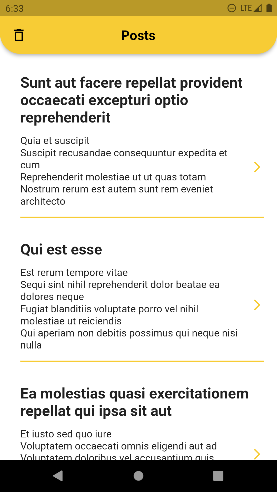
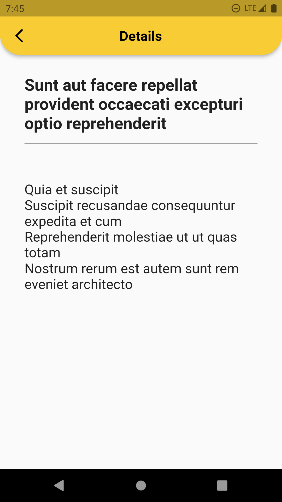
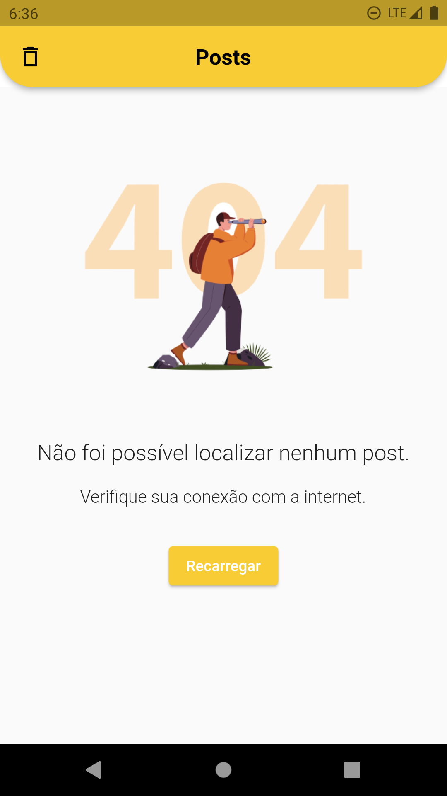
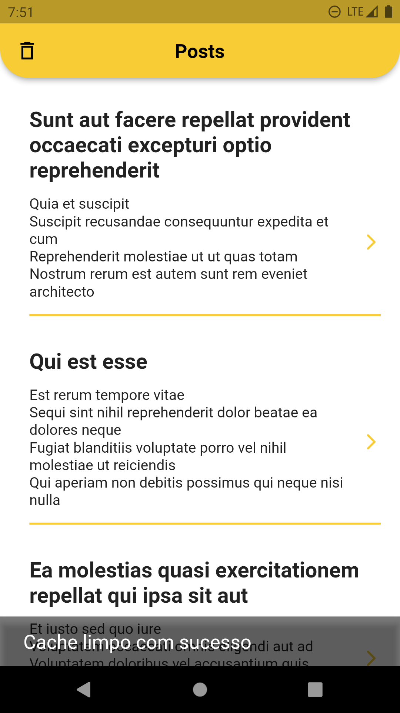

# SalaryFits Posts 

## 📄 Sobre

SalaryFits Posts é um aplicativo mobile, que renderiza todos os Posts obtidos através de uma API, com a opção de selecionar um post específico para ver detalhadamente.

  
  
  

---

## 🛠 Ferramentas & Metodologias Utilizadas

- Flutter / Dart
- Nuvigator
- Shared Preferences
- Tratamento de erros
- Http
- Componentização

---

## 👨‍💻 Algumas funções implementadas:

- Tratamento de erros.\
 \- Diferentes telas dependendo do erro.

  
  

 

- Cache.\
  \- Para tornar o app mais performático, evitando requisições desnecessárias \
  \- Opção de apagar cache ao clicar na lixeira da appBar.

  

